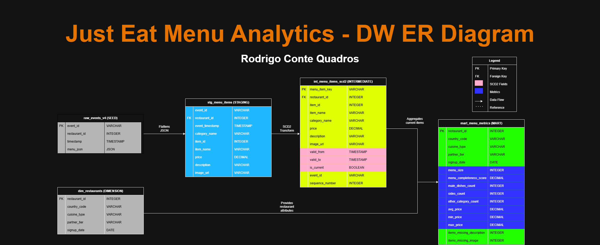

# Just Eat Menu Analytics - dbt Project

**Candidate:** Rodrigo Conte Quadros  
**Role:** Analytics Engineer
**Date:** February 2026

---

## Project Overview

This dbt project transforms raw menu event history data into analyst-friendly tables that track menu changes over time. It implements a complete data warehouse architecture with:

- **JSON flattening** - Unnesting nested menu structures to item-level grain
- **SCD2** - Historical tracking of menu item changes with temporal validity
- **Incremental loading** - Efficient processing of new events
- **Business metrics** - Menu size, completeness scores, and category breakdowns
- **Data quality tests** - Automated tests ensuring data integrity

---

## Architecture

### **Layered Data Warehouse Design**

```
Seeds (Raw Data)
    ↓
Staging Layer (Flattened & Cleaned)
    ↓
Intermediate Layer (Change Detection & SCD2)
    ↓
Dimensions & Marts (Analytics-Ready)
```

### **Data Models**

| Layer | Model | Materialization | Description |
|-------|-------|-----------------|-------------|
| **Seeds** | `raw_menu_events_v4` | Seed | Raw menu JSON events |
| | `dim_restaurants_v3` | Seed | Restaurant attributes |
| **Staging** | `stg_menu_items` | Incremental | Flattened menu items from JSON |
| **Dimensions** | `dim_restaurants` | Table | Clean restaurant dimension |
| **Intermediate** | `int_menu_items_with_changes` | Incremental | Change detection logic |
| | `int_menu_items_scd2` | Table | SCD Type 2 with valid_from/valid_to |
| **Marts** | `mart_menu_metrics` | Table | Restaurant-level analytics |

---

## Entity-Relationship Diagram



The diagram above shows the complete data warehouse architecture:
- **Data flow** from raw sources (seeds) through staging, intermediate, and mart layers
- **SCD2 implementation** in the intermediate layer tracking historical menu changes
- **Star schema structure** with `dim_restaurants` as the dimension table
- **Relationships** showing how restaurant data joins with menu items and aggregated metrics
- **Primary keys (PK)** and **Foreign keys (FK)** clearly marked

---

## Setup & Installation

### **Prerequisites**
- Python 3.11 or 3.12
- Git (optional for version control)

### **Installation Steps**

1. **Clone/Download the repository**
   ```bash
   cd path/to/just_eat_case_study/menu_analytics
   ```

2. **Create virtual environment**
   ```bash
   python -m venv dbt_env
   ```

3. **Activate environment**
   ```bash
    Windows
   dbt_env\Scripts\activate
   
    Mac/Linux
   source dbt_env/bin/activate
   ```

4. **Install dependencies**
   ```bash
   pip install dbt-duckdb pip-system-certs
   ```

5. **Install dbt packages**
   ```bash
   dbt deps
   ```

6. **Verify connection**
   ```bash
   dbt debug
   ```

---

## Running the Project

### **Initial Load (Full Refresh)**

```bash
dbt seed

dbt run --full-refresh

dbt test
```

### **Incremental Runs (Production Mode)**

```bash
dbt run

dbt run -s stg_menu_items+
```

### **Generate Documentation**

```bash
dbt docs generate
dbt docs serve
```

This opens an interactive documentation site with data lineage visualization at http://localhost:8080

---

## Incremental Loading Strategy

### **Staging Layer (`stg_menu_items`)**
- **Strategy:** Incremental based on event timestamp
- **Logic:** Only processes events with `timestamp > MAX(event_timestamp)` from existing table
- **Efficiency:** Reduces processing time for large historical datasets

```sql
WHERE timestamp > (SELECT MAX(event_timestamp) FROM {{ this }})
```

### **Intermediate Layer (`int_menu_items_with_changes`)**
- **Strategy:** Incremental based on event_id
- **Logic:** Only processes events not yet seen
- **Purpose:** Tracks what changed between events

### **SCD2 Layer (`int_menu_items_scd2`)**
- **Strategy:** Full refresh from intermediate layer
- **Rationale:** Ensures correct valid_from/valid_to calculations
- **Trade-off:** Rebuilds entire history but guarantees correctness

---

## SCD2 Implementation

### **Design Decision**

I implemented **SCD2** with non-overlapping date ranges:
- `valid_from`: Timestamp when this version became active (inclusive)
- `valid_to`: Timestamp when this version became inactive (exclusive, minus 1 second)
- `is_current`: Boolean flag for the current active version

### **Example:**
```
Item: Classic Burger (ID 101)
├─ 2024-01-22 to 2024-04-28 23:59:59 | Price: £10.13 | is_current: FALSE
├─ 2024-04-29 to 2024-06-15 23:59:59 | Price: £10.29 | is_current: FALSE
└─ 2024-06-16 to NULL              | Price: £9.91  | is_current: TRUE
```

### **Why SCD2 over Daily Snapshots?**

**Pros:**
- Storage efficient (only stores actual changes)
- Preserves exact change timestamps
- Scalable for high-frequency menu updates

**Cons:**
- Requires date range queries (WHERE date >= valid_from AND date < valid_to)
- More complex for analysts

**Mitigation:** Created helper views and marts that abstract complexity for common use cases.

---

## Business Metrics

The `mart_menu_metrics` table provides restaurant-level KPIs:

| Metric | Description | Calculation |
|--------|-------------|-------------|
| **menu_size** | Total items on menu | COUNT(item_id) |
| **menu_completeness_score** | % items with description AND image | % with both fields populated |
| **main_dishes_count** | Number of main dishes | COUNT WHERE category = 'Main Dishes' |
| **sides_count** | Number of sides | COUNT WHERE category = 'Sides' |
| **avg_price** | Average item price | AVG(price) |
| **min_price** / **max_price** | Price range | MIN/MAX(price) |

---

## Data Quality Tests

### **Generic Tests (5)**
- `unique` - Restaurant ID uniqueness
- `not_null` - Critical field validation (restaurant_id, menu_size, etc.)
- `accepted_range` - Menu completeness score between 0-100

### **Custom SQL Tests (3)**
- **Price validation** - Ensures avg_price ≤ max_price and all prices ≥ 0
- **Completeness range** - Validates score is 0-100
- **Category integrity** - Ensures category counts sum to menu_size

**Total:** 8 automated tests, all passing

---

## Backfill Strategy

### **Scenario: Historical data arrives late**

1. **Add new events to seed file**
   ```bash
    Events automatically picked up on next run
   ```

2. **Run incremental models**
   ```bash
   dbt run -s stg_menu_items+
   ```
   - Staging processes only new events (efficient)
   - Intermediate layers detect changes
   - SCD2 rebuilds with new history included

3. **Full refresh option**
   ```bash
   dbt run --full-refresh
   ```
   - Use when data quality issues detected
   - Rebuilds entire pipeline from scratch

### **Production Scheduling Recommendation**

```
Daily Schedule:
├─ 02:00 AM - dbt seed (if new data arrives)
├─ 02:05 AM - dbt run (incremental)
└─ 02:15 AM - dbt test (validate)

Weekly Schedule (Sunday):
└─ 03:00 AM - dbt run --full-refresh (full rebuild for data integrity)
```

---

## Project Structure

```
menu_analytics/
├── models/
│   ├── staging/
│   │   └── stg_menu_items.sql
│   ├── dimensions/
│   │   ├── dim_restaurants.yml
│   │   └── dim_restaurants.sql
│   ├── intermediate/
│   │   ├── int_menu_items_with_changes.sql
│   │   └── int_menu_items_scd2.sql
│   └── marts/
│       ├── mart_menu_metrics.yml
│       └── mart_menu_metrics.sql
│   ├── schme.yml
├── seeds/
│   ├── raw_menu_events_v4.csv
│   └── dim_restaurants_v3.csv
├── diagrams/
│   └── er_diagram.png
├── dbt_project.yml
├── packages.yml
└── README.md
```

---

## Key Design Decisions

### **1. DuckDB vs BigQuery**
- **Chosen:** DuckDB for local development
- **Rationale:** Fast iteration, no cloud setup needed, same SQL concepts
- **Production:** Code is 95% compatible with BigQuery (only JSON functions differ slightly)

### **2. Incremental Staging + Full Refresh SCD2**
- **Staging:** Incremental for efficiency
- **SCD2:** Full refresh to ensure correctness
- **Trade-off:** Balanced performance vs. correctness

### **3. Non-overlapping Date Ranges**
- **Approach:** `valid_to = LEAD(valid_from) - 1 second`
- **Benefit:** No ambiguity on boundary dates
- **Query pattern:** `WHERE date >= valid_from AND date < valid_to` (for historical queries)

---

## Production Considerations

### **For Production Deployment:**

1. **Orchestration:** Use Airflow, or similar
2. **CI/CD:** Git workflow with pull requests, automated testing
3. **Monitoring:** Set up data quality alerts for test failures
4. **Partitioning:** Partition SCD2 tables by `valid_from` date for query performance
5. **Incremental SCD2:** Consider implementing merge logic for very large datasets
6. **Documentation:** Keep schema.yml files updated as requirements evolve

---

## References

- [dbt Documentation](https://docs.getdbt.com/)
- [SCD2 Best Practices](https://www.kimballgroup.com/data-warehouse-business-intelligence-resources/kimball-techniques/dimensional-modeling-techniques/)
- [DuckDB JSON Functions](https://duckdb.org/docs/extensions/json.html)

---

## Contact

For questions about this implementation:
- **Candidate:** Rodrigo Conte Quadros
- **Project:** Just Eat Analytics Engineer Case Study
